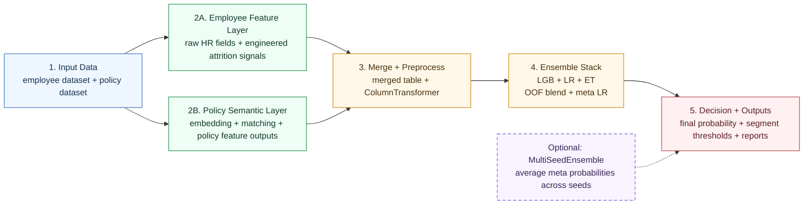

# Current Attrition Model Architecture

This version is intentionally simplified for presentation clarity and follows a left-to-right reading order.

Key code anchors:

- `run_pipeline`: [models/v3_1_blue.py](F:/app_bundle/models/v3_1_blue.py#L3754)
- `train_stacking_lgb`: [models/v3_1_blue.py](F:/app_bundle/models/v3_1_blue.py#L2421)
- `train_multi_seed_ensemble`: [models/v3_1_blue.py](F:/app_bundle/models/v3_1_blue.py#L2831)
- `BlendedAttritionModel`: [models/v3_1_blue.py](F:/app_bundle/models/v3_1_blue.py#L2210)
- `MultiSeedEnsembleModel`: [models/v3_1_blue.py](F:/app_bundle/models/v3_1_blue.py#L2242)

## Mermaid Source

## Reading Notes

- Default path: one stacking model from `train_stacking_lgb(...)`.
- Optional path: `enable_seed_stability=True` wraps several full stacks with `MultiSeedEnsembleModel`.
- Final classification is segment-aware, not just one global threshold.
