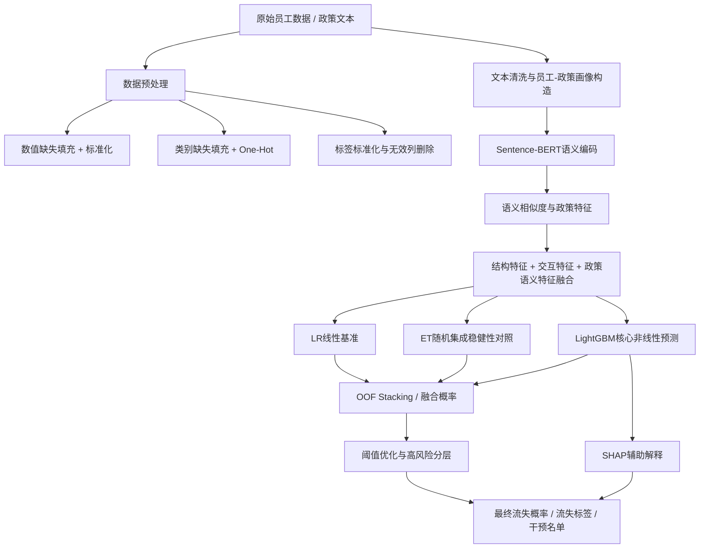

# 员工流失预测与政策匹配模型方法说明

本文档用于论文写作、答辩汇报和模型方案检查。实验数值不得在未运行实验前填写；本文中涉及消融结果的位置统一使用“待实验验证”。

## 1. 现有模型缺失内容清单

当前模型主链条已经具备：员工原始数据、数据清洗、交互特征、政策文本语义匹配、LR/ET/LGB基础模型、OOF二层融合、阈值决策、SHAP解释和预测名单输出。

需要在论文或答辩中补充说明的内容如下：

| 检查项 | 当前状态 | 需要补充的写法 |
|---|---|---|
| 数据预处理方式 | 已在代码中实现 | 说明缺失值处理、数值标准化、类别One-Hot、无建模价值列删除、标签标准化 |
| 文本清洗方式 | 已在代码中实现 | 说明政策文本和员工画像文本会进行空值处理、文本拼接和语义编码 |
| Sentence-BERT模型名称 | 已实现 | 写明默认优先使用 `sentence-transformers/paraphrase-multilingual-MiniLM-L12-v2` |
| 向量维度与pooling | 需要在论文中明确 | MiniLM句向量通常为384维，SentenceTransformer默认使用mean pooling；以实际模型配置为准 |
| TF-IDF对照 | 已有fallback，缺系统消融 | 通过新增 `tools/model_ablation_suite.py` 导出/运行TF-IDF对照 |
| 语义向量如何入模 | 已实现为政策匹配特征 | 写明语义相似度、政策支持/约束、主题暴露等数值特征进入LR/ET/LGB |
| LR、ET、LGB关系 | 已融合 | 当前主模型为OOF Stacking二层融合，同时保留基础模型概率和融合权重 |
| 融合公式 | 需要论文明确 | 写明加权概率与二层LR元学习器两种表达 |
| 阈值设定 | 已实现 | 写明阈值在OOF上优化F1、Precision、Recall、Accuracy和名单率约束，并做风险分层 |
| 评价指标 | 已实现 | 统一报告Accuracy、Precision、Recall、F1、AUC、Confusion Matrix、Brier、RMSE、R方 |
| SHAP解释对象 | 已实现 | SHAP解释代表seed中的LightGBM子模型，不直接解释融合器本身 |
| 消融实验 | 新增设计脚本 | 用13组消融表证明Sentence-BERT、LR、ET、LGB、SHAP各自作用 |
| 可视化图 | 已补主模型导出 | 新增ROC/PR/混淆矩阵、LR曲线、LR系数、LGB Gain、ET-LGB对比、LGB训练曲线、SHAP图 |

## 2. 最终模型决策流程图



## 3. 数据预处理模块

模型首先对员工数据进行字段标准化和质量检查。流失标签统一映射为 `AttritionFlag`，其中流失为1，未流失为0；数值型特征采用中位数填充和标准化，类别型特征采用众数填充和One-Hot编码。模型训练前移除无直接建模价值或容易引入编号噪声的字段，例如 `EmployeeNumber`、`Over18`、`StandardHours`、`DailyRate`、`HourlyRate`。

该步骤的作用是把不同来源、不同格式的员工数据转换成统一的建模矩阵，减少缺失值、异常编码和无效字段对模型训练的干扰。

## 4. Sentence-BERT文本语义表示模块

Sentence-BERT负责将政策文本、岗位信息和员工需求画像从自然语言转换为稠密语义向量。给定文本句子或文本片段 `s`，语义编码过程可表示为：

```text
e_s = f_theta(s)
```

其中，`f_theta` 表示预训练Sentence-BERT编码器，`e_s` 表示文本 `s` 的语义向量。当前模型优先使用：

```text
sentence-transformers/paraphrase-multilingual-MiniLM-L12-v2
```

在该类SentenceTransformer模型中，Transformer输出会通过pooling层汇聚为句向量；常用形式为mean pooling。若使用默认模型配置，向量维度通常为384维，最终以实际加载模型的配置为准。

当需要计算员工画像与政策文本之间的匹配程度时，使用余弦相似度：

```text
sim(e_i, e_j) = e_i^T e_j / (||e_i|| ||e_j||)
```

Sentence-BERT不直接输出“是否流失”的分类结果。它的作用是让模型看到更有语义含义的特征，例如政策匹配均值、最大匹配分、Top3匹配均值、岗位政策匹配、政策支持分、政策约束分、净支持分和不同主题政策暴露度。这些特征再输入LR、ET和LGB，间接影响最终预测概率。

需要补充的图：

| 图 | 目的 |
|---|---|
| Sentence-BERT向量二维降维图 | 观察语义空间是否形成可解释聚集 |
| TF-IDF与Sentence-BERT二维分布对比图 | 证明稠密语义表示相对稀疏词频特征的表达差异 |
| 不同类别样本语义空间聚集图 | 观察流失/未流失或高风险/低风险样本是否在语义空间中分离 |

需要补充的消融实验：

| 实验 | 证明内容 |
|---|---|
| TF-IDF + LR | 传统文本特征和线性模型的最低基准 |
| TF-IDF + LGB | 非线性模型能否从传统文本特征中提取有效信息 |
| Sentence-BERT + LR | 语义向量本身是否提高线性可分性 |
| Sentence-BERT + LGB | 语义向量与核心非线性模型的组合效果 |
| Sentence-BERT + ET | 语义向量在随机树集成下的稳健性 |
| Full Model without Sentence-BERT | 去掉语义模块后的整体下降幅度 |
| Full Model | 完整模型最终表现 |

## 5. LR + ET：基准模型与稳健性对照模块

LR和ET可以合并为“基准模型与稳健性对照模块”。两者不是模型性能主力的同一种方法，而是从两个角度补充整体方案：

| 模型 | 角色 |
|---|---|
| LR | 线性基准模型，检查特征与流失结果之间是否存在稳定线性关系，并提供系数解释 |
| ET | 随机树集成稳健性模型，通过多棵随机树平均降低单棵树波动，用于和LGB形成对照 |

LR公式：

```text
z = w^T x + b
P(y=1|x) = 1 / (1 + e^(-z))
y = 1, if P(y=1|x) >= tau
```

ET公式：

```text
P(y=1|x) = 1/T * sum_t P_t(y=1|x)
```

其中，`T`为树的数量，`P_t`为第`t`棵树输出的正类概率。

需要补充的图：

| 图 | 目的 |
|---|---|
| LR Sigmoid决策曲线 | 解释线性得分如何映射为概率 |
| LR特征系数条形图 | 展示线性模型中正向/负向影响较大的特征 |
| ET特征重要性图 | 展示随机树集成关注的主要变量 |
| ET与LGB特征重要性对比图 | 比较随机集成与Boosting对特征的偏好 |
| 不同随机种子下模型性能箱线图 | 验证模型稳定性和泛化波动 |

需要补充的消融实验：

| 实验 | 证明内容 |
|---|---|
| LR only | 线性基准性能 |
| ET only | 随机集成稳健性性能 |
| Sentence-BERT + LR | 语义向量在线性模型下的贡献 |
| Sentence-BERT + ET | 语义向量在随机树集成下的贡献 |
| Full Model without LR | LR对融合模型是否有边际贡献 |
| Full Model without ET | ET对融合稳定性是否有边际贡献 |
| Full Model | 完整融合表现 |

## 6. LightGBM核心非线性预测模块

LightGBM是当前模型的核心非线性预测模块。它通过Boosting逐轮训练多棵弱学习树，每一轮重点修正前一轮的预测误差，从而捕捉员工结构特征、交互特征、政策语义特征之间的复杂非线性关系。

模型可表示为：

```text
F(x) = sum_m eta f_m(x)
P(y=1|x) = sigma(F(x))
```

其中，`f_m(x)`表示第`m`棵树，`eta`表示学习率，`sigma`表示Sigmoid函数。

与LR、ET的区别：

| 模型 | 主要能力 |
|---|---|
| LR | 捕捉线性关系，解释性强 |
| ET | 多棵随机树独立投票，强调稳定性 |
| LGB | Boosting逐轮修正误差，强调非线性拟合和性能提升 |

需要补充的图：

| 图 | 目的 |
|---|---|
| LightGBM Feature Importance by Gain | 说明LGB主要依赖哪些特征提升分裂收益 |
| 训练轮数-AUC曲线 | 展示早停和性能收敛过程 |
| 训练轮数-Logloss曲线 | 展示概率损失下降过程 |
| ROC曲线或PR曲线 | 展示排序能力和不平衡数据下的识别能力 |
| 去掉LGB前后的性能对比图 | 证明LGB是否为主要性能贡献模块 |

需要补充的消融实验：

| 实验 | 证明内容 |
|---|---|
| LGB only | 核心单模型性能 |
| Sentence-BERT + LGB | 语义增强对LGB的贡献 |
| LR + LGB | 线性基准是否补充LGB |
| LGB + ET | 随机集成是否补充LGB |
| Full Model without LGB | 去掉核心模型后性能下降幅度 |
| Full Model | 完整模型性能 |

如果去掉LGB后AUC、F1、Recall或PR表现明显下降，可以说明LGB是主要性能贡献模块；如果没有下降，则需要检查LGB超参数、融合权重或数据噪声。

## 7. 模型融合与最终阈值决策

当前主模型不是简单只选一个模型，而是采用OOF Stacking融合逻辑。基础模型包括LR、ET和LGB。每个基础模型先输出流失概率：

```text
P_LR, P_LGB, P_ET
```

基础加权融合可写为：

```text
P = alpha P_LR + beta P_LGB + gamma P_ET
alpha + beta + gamma = 1
```

当前代码进一步使用OOF预测构造二层特征，并训练轻量LR元学习器作为Stacking融合器。二层特征包括基础模型概率、加权融合概率、均值概率、概率标准差和模型分歧度。这样可以减少直接在训练集上融合导致的乐观偏差。

最终分类阈值为：

```text
y = 1, if P >= tau
y = 0, if P < tau
```

阈值 `tau` 不是固定0.5，而是在OOF验证预测上搜索得到。搜索目标综合考虑F1、Precision、Recall、Accuracy和预测流失名单率约束。对于员工流失预警，类别通常不平衡，因此不能只看Accuracy；如果模型全部预测为“不流失”，Accuracy可能仍然较高，但Recall和F1会很差，无法满足预警任务。

## 8. SHAP辅助解释模块

SHAP应写成辅助解释模块，而不是提高预测准确率的模块。它不参与训练，不改变模型预测概率，也不改变最终分类标签。

SHAP解释公式为：

```text
f(x) = phi_0 + sum_j phi_j
```

其中，`phi_0`表示基础预测值，`phi_j`表示第`j`个特征对当前样本预测的贡献。

当前模型中，SHAP解释对象为LightGBM代表子模型。原因是LGB是核心非线性预测器，树模型也最适合用TreeSHAP高效解释。对于融合模型，论文中应说明：SHAP解释的是核心LGB子模型的主要决策依据，用于辅助理解完整模型的风险来源。

需要补充的图：

| 图 | 目的 |
|---|---|
| SHAP Summary Plot | 总体展示特征对模型输出的影响方向和强度 |
| SHAP Bar Plot | 按平均绝对SHAP值排序展示全局重要性 |
| SHAP Waterfall Plot | 对单个正确预测样本做个体解释 |
| SHAP Waterfall Error Case | 对错误预测样本做误判原因分析 |
| SHAP Dependence Plot | 展示关键特征取值变化与模型输出贡献之间的关系 |

解释性验证：

| 对比 | 说明 |
|---|---|
| 无SHAP | 只能看到预测概率和预测标签 |
| 有SHAP | 可以看到每个特征对该员工风险判断的正向或负向贡献 |
| SHAP Top特征与LGB/ET重要性一致 | 说明模型全局解释较稳定 |
| 正确预测样本解释 | 说明模型如何识别典型高风险或低风险员工 |
| 错误预测样本解释 | 说明模型在哪些场景下可能误判，为人工复核提供依据 |

## 9. 总消融实验设计表

完整消融实验表由 `tools/model_ablation_suite.py` 生成，至少包含以下14组：

| 编号 | 模型组合 | 实验目的 | 观察指标 | 解释方式 |
|---|---|---|---|---|
| 1 | TF-IDF + LR | 建立传统文本+线性最低基准 | Accuracy、Precision、Recall、F1、AUC | 若较低，说明简单词频和线性边界不足 |
| 2 | TF-IDF + LGB | 检查非线性模型利用传统文本的能力 | Accuracy、Precision、Recall、F1、AUC | 与1相比上升说明LGB有非线性贡献 |
| 3 | Sentence-BERT + LR | 检查语义向量是否提高线性可分性 | Accuracy、Precision、Recall、F1、AUC | 与1相比上升说明Sentence-BERT有效 |
| 4 | Sentence-BERT + ET | 检查语义特征在随机树集成下的稳健性 | AUC、F1、不同seed波动 | 稳定则支持ET稳健性对照 |
| 5 | Sentence-BERT + LGB | 检查语义增强下LGB核心性能 | AUC、PR、F1、Recall | 若高于2说明语义表示有效 |
| 6 | Sentence-BERT + LR + LGB | 检查LR是否补充LGB | AUC、F1、概率校准 | 上升说明线性概率有互补信息 |
| 7 | Sentence-BERT + LGB + ET | 检查ET是否补充LGB稳定性 | AUC、F1、seed稳定性 | 上升或波动变小说明ET有效 |
| 8 | Sentence-BERT + LR + LGB + ET | 检查完整预测器组合 | AUC、F1、OOF/Test差距 | 作为完整预测组合对照 |
| 9 | Full Model without Sentence-BERT | 直接检验语义模块贡献 | AUC、F1、Recall | 明显下降说明Sentence-BERT重要 |
| 10 | Full Model without LR | 检验LR边际贡献 | AUC、F1、校准指标 | 下降说明LR提供线性补充 |
| 11 | Full Model without ET | 检验ET边际贡献 | AUC、F1、seed稳定性 | 下降或波动增大说明ET有效 |
| 12 | Full Model without LGB | 检验LGB核心贡献 | AUC、F1、PR | 明显下降说明LGB是核心模块 |
| 13 | Full Model + SHAP explanation | 验证解释输出 | SHAP图和案例解释 | 指标不应变化，价值体现在透明性 |
| 14 | Full Model OOF Logistic Stacking | 使用主模型同口径验证最终融合性能 | OOF-AUC、OOF-F1、Test-AUC、Test-F1、OOF/Test差距 | 与同一OOF协议下的单模型和去模块组合对比，证明正式OOF Stacking融合策略的最终贡献 |

## 10. 统一评价指标

论文中建议统一报告以下指标：

| 指标 | 含义 |
|---|---|
| Accuracy | 全部样本中预测正确的比例 |
| Precision | 预测为流失的员工中，真实流失的比例 |
| Recall | 真实流失员工中，被模型识别出来的比例 |
| F1-score | Precision和Recall的调和平均 |
| AUC | 模型对正负样本的排序区分能力 |
| Confusion Matrix | TP、FP、TN、FN的完整分类分布 |
| Brier / RMSE / R方 | 预测概率与0/1真实标签之间的概率误差评估 |

由于员工流失通常是不平衡分类任务，Accuracy不能作为唯一评价标准。汇报时应重点看Precision、Recall、F1和AUC，并结合业务目标说明：如果目标是提前发现可能流失员工，Recall和Top-K名单命中率通常比单纯Accuracy更关键。

## 11. 适合论文或答辩的讲述顺序

推荐讲述顺序：

1. 研究任务：预测员工流失风险，并结合政策匹配信息辅助干预。
2. 数据来源与预处理：说明员工结构化数据、政策文本数据、标签处理、缺失值处理和编码方式。
3. Sentence-BERT文本语义模块：说明模型如何理解政策文本与员工画像。
4. 特征融合：说明结构特征、交互特征、政策语义特征如何合并。
5. LR + ET基准与稳健性对照模块：说明为什么需要线性基准和随机树稳健性参照。
6. LightGBM核心预测模块：说明核心非线性拟合能力和Boosting机制。
7. 模型融合与阈值决策：说明最终概率来自哪里、阈值如何确定、为什么不能只看Accuracy。
8. 消融实验：逐项证明Sentence-BERT、LR、ET、LGB和SHAP的作用。
9. SHAP辅助解释：说明模型如何支持人工复核和决策解释。
10. 结论与改进方向：说明当前结果、泛化能力、数据质量和后续优化。

## 12. 修改后的完整模型描述文本

本文构建了一个融合文本语义理解、结构化特征学习和可解释分析的员工流失预测模型。模型输入包括员工结构化信息和政策文本信息。首先，对员工数据进行标签标准化、缺失值处理、数值标准化和类别One-Hot编码，并删除无建模价值或容易引入噪声的字段。在此基础上，构造加班、满意度、晋升等待、岗位停滞、差旅压力等交互特征，以增强模型对员工状态的表达能力。

在文本语义表示方面，模型引入Sentence-BERT作为语义编码模块。给定文本 `s`，Sentence-BERT通过 `e_s=f_theta(s)` 将其映射为稠密语义向量。对于员工岗位画像与政策文本之间的关系，模型使用余弦相似度 `sim(e_i,e_j)=e_i^T e_j/(||e_i||||e_j||)` 计算匹配程度，并进一步形成政策匹配均值、最大匹配分、Top3匹配均值、岗位政策匹配、政策支持分、政策约束分、政策净支持分和主题政策暴露度等特征。Sentence-BERT本身不直接输出流失分类结果，而是通过增强后续模型可见的语义特征，间接影响最终预测。

预测模型由LR、ET和LightGBM三个基础模型组成。LR作为线性基准模型，用于检验特征与流失结果之间是否存在稳定线性关系，并提供系数层面的解释；ET作为随机树集成稳健性模型，通过多棵随机树平均降低单模型波动；LightGBM作为核心非线性预测模块，通过Boosting逐轮修正预测误差，捕捉结构特征、语义特征和交互特征之间的复杂非线性关系。

最终预测阶段，模型基于OOF预测进行Stacking融合。基础模型分别输出 `P_LR`、`P_LGB` 和 `P_ET`，可表示为加权融合形式 `P=alpha P_LR + beta P_LGB + gamma P_ET`，其中 `alpha+beta+gamma=1`。当前主模型进一步使用基础模型概率、加权融合概率、均值概率、概率标准差和模型分歧度训练二层LR元学习器，以获得最终流失概率。分类阈值 `tau` 在OOF验证预测上确定，综合优化F1、Precision、Recall、Accuracy和预测名单率约束，最终按照 `P>=tau` 判断为高流失风险。

模型评价采用Accuracy、Precision、Recall、F1-score、AUC和混淆矩阵等指标。考虑到员工流失预测存在类别不平衡，仅使用Accuracy可能掩盖模型对少数类流失员工的识别能力，因此本文重点关注Precision、Recall、F1和AUC。同时，模型输出Brier、RMSE和R方等概率误差指标，用于补充评估预测概率与真实标签之间的一致性。

为验证各模块贡献，本文设计TF-IDF、Sentence-BERT、LR、ET、LGB以及完整模型去模块版本的消融实验。通过比较 `Full Model without Sentence-BERT` 与 `Full Model`，验证语义模块贡献；通过比较 `Full Model without LGB` 与完整模型，验证LightGBM是否为主要性能来源；通过去掉LR或ET，验证线性基准和随机集成稳健性模块的边际价值。所有消融结果需通过实际实验填入，未运行前不预设结论。

最后，模型使用SHAP作为辅助解释模块。SHAP不参与模型训练，也不改变预测结果，而是解释核心LightGBM子模型的判断依据。通过SHAP Summary Plot、Bar Plot、Waterfall Plot和Dependence Plot，可以展示全局关键特征、单个员工风险来源以及错误预测案例，为人工复核和管理干预提供依据。由此，模型形成了“Sentence-BERT负责文本理解，LR和ET负责基准与稳健性对照，LightGBM负责核心非线性预测，消融实验负责证明模块贡献，SHAP负责解释最终决策”的完整方法链条。
